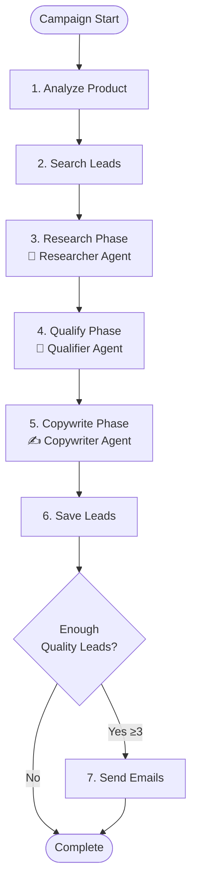

# 🤖 Multi-Agent Collaborative System

## Complete Technical Documentation

---

## Table of Contents

1. [Overview](#overview)
2. [Architecture](#architecture)
3. [Agent Roles & Responsibilities](#agent-roles--responsibilities)
4. [Workflow Execution](#workflow-execution)
5. [State Management](#state-management)
6. [Configuration](#configuration)
7. [File Structure](#file-structure)
8. [Technical Implementation](#technical-implementation)
9. [Performance Benefits](#performance-benefits)
10. [API Reference](#api-reference)
11. [Troubleshooting](#troubleshooting)

---

## Overview

The Multi-Agent Collaborative System transforms the B2B Sales Agent from a single monolithic AI agent into a team of specialized AI agents that work together. Each agent has a specific expertise and contributes to the sales pipeline in its own domain.

### Why Multi-Agent?

| Problem with Single Agent | Solution with Multi-Agent |
|--------------------------|---------------------------|
| Generic prompts try to do everything | Specialized prompts for each task |
| One-size-fits-all email templates | Personalized emails per lead |
| Surface-level lead scoring | Deep qualification with reasoning |
| Basic company research | Thorough intelligence gathering |
| Sequential bottlenecks | Parallel agent execution |

---

## Architecture

```
┌─────────────────────────────────────────────────────────────────────────────┐
│                         MULTI-AGENT ORCHESTRATOR                            │
│                    (LangGraph StateGraph Workflow)                          │
│                                                                             │
│   ┌──────────────┐    ┌──────────────┐    ┌──────────────┐                 │
│   │   ANALYZE    │───▶│   SEARCH     │───▶│   RESEARCH   │                 │
│   │   PRODUCT    │    │   LEADS      │    │    PHASE     │                 │
│   └──────────────┘    └──────────────┘    └──────┬───────┘                 │
│                                                   │                         │
│                                                   ▼                         │
│   ┌──────────────┐    ┌──────────────┐    ┌──────────────┐                 │
│   │    SEND      │◀───│   COPYWRITE  │◀───│   QUALIFY    │                 │
│   │   EMAILS     │    │    PHASE     │    │    PHASE     │                 │
│   └──────────────┘    └──────────────┘    └──────────────┘                 │
│                                                                             │
└─────────────────────────────────────────────────────────────────────────────┘
                                    │
        ┌───────────────────────────┼───────────────────────────┐
        │                           │                           │
        ▼                           ▼                           ▼
┌───────────────────┐   ┌───────────────────┐   ┌───────────────────┐
│  🔬 RESEARCHER    │   │  🎯 QUALIFIER     │   │  ✍️ COPYWRITER    │
│     AGENT         │   │     AGENT         │   │     AGENT         │
├───────────────────┤   ├───────────────────┤   ├───────────────────┤
│ • Deep research   │   │ • ICP matching    │   │ • Email writing   │
│ • Data scraping   │   │ • ML scoring      │   │ • Personalization │
│ • Contact finding │   │ • Semantic match  │   │ • 3 variants      │
│ • Pain point ID   │   │ • Reasoning       │   │ • CTA optimization│
│ • Tech stack      │   │ • Objections      │   │ • A/B readiness   │
└───────────────────┘   └───────────────────┘   └───────────────────┘
```

---

## Agent Roles & Responsibilities

### 🔬 Researcher Agent

**Mission:** Extract the most valuable, actionable intelligence about companies.

**Capabilities:**
- Web scraping for company data using ScraperService
- AI-powered extraction of business model, technology stack
- Pain point identification based on industry and description
- Decision maker discovery (names, titles, LinkedIn)
- Contact email extraction and verification

**System Prompt Highlights:**
```
You are an elite B2B company research analyst with 15+ years 
of experience in market intelligence.

RESEARCH METHODOLOGY:
1. Company Overview: Name, industry, size, headquarters
2. Business Model: What they sell, who they serve
3. Technology Stack: Tools/platforms they use
4. Pain Points: Challenges they might face
5. Decision Makers: Key executives, their roles
6. Recent News: Funding, expansions, challenges
7. Contact Info: Verified email patterns
```

**Output Schema:**
```json
{
    "company_name": "Exact company name",
    "industry": "Primary industry",
    "sub_industry": "Specific niche",
    "company_size": "1-10 / 11-50 / 51-200 / 201-500 / 500+",
    "business_model": "How they make money",
    "technology_stack": ["Tool1", "Tool2"],
    "pain_points": ["Pain 1", "Pain 2"],
    "decision_makers": [{"name": "John Doe", "title": "CEO"}],
    "contact_email": "john@company.com",
    "research_confidence": 0.85
}
```

---

### 🎯 Qualifier Agent

**Mission:** Evaluate leads against Ideal Customer Profile with detailed reasoning.

**Capabilities:**
- ICP (Ideal Customer Profile) fit analysis
- ML scoring using XGBoost model
- Semantic similarity matching with embeddings
- AI-powered qualification with reasoning
- Objection anticipation
- Recommended approach suggestion

**Qualification Framework:**
| Factor | Weight | Description |
|--------|--------|-------------|
| ICP Fit | 40% | Industry, size, geography match |
| Pain Point Alignment | 30% | Problem-solution fit |
| Buying Signals | 20% | Funding, hiring, tech investments |
| Accessibility | 10% | Contact quality, decision maker ID |

**Scoring Tiers:**
| Score | Tier | Action |
|-------|------|--------|
| 80-100 | 🔥 HOT | Immediate outreach |
| 60-79 | 🟡 WARM | Worth pursuing |
| 40-59 | 🔵 COLD | Needs nurturing |
| 0-39 | ❌ DISQUALIFY | Skip |

**Output Schema:**
```json
{
    "qualification_score": 85,
    "qualification_tier": "HOT",
    "icp_fit": {
        "score": 90,
        "reasoning": "Perfect industry and size match"
    },
    "pain_point_alignment": {
        "score": 80,
        "identified_pains": ["Manual processes", "Scaling issues"],
        "reasoning": "Our product directly addresses their automation needs"
    },
    "buying_signals": {
        "score": 75,
        "signals_found": ["Recent Series B", "Hiring sales team"],
        "reasoning": "Strong buying intent indicators"
    },
    "objections_anticipated": ["Price concern", "Integration complexity"],
    "recommended_approach": "Lead with ROI case study",
    "confidence": 0.88
}
```

---

### ✍️ Copywriter Agent

**Mission:** Craft highly personalized, compelling emails that get responses.

**Capabilities:**
- Generates 3 email variants per lead
- Pain point personalization
- Industry-specific messaging
- Social proof integration
- CTA optimization

**Email Variants:**

| Variant | Style | Best For |
|---------|-------|----------|
| 1 | INSIGHT-LED | Thought leadership approach |
| 2 | DIRECT-PITCH | Clear value proposition |
| 3 | SOCIAL-PROOF | Case study driven |

**Copywriting Principles:**
1. **Personalization is King** - Reference specific company details
2. **Value-First Approach** - Lead with insight, not pitch
3. **Psychological Triggers** - Social proof, scarcity, authority
4. **Structure for Opens** - Hook → Problem → Solution → CTA

**Email Rules:**
- Maximum 120 words
- No jargon or buzzwords
- Sound human, not robotic
- Include 1 question to encourage reply
- No attachments in first email

**Output Schema:**
```json
{
    "email_variant_1": {
        "style": "INSIGHT-LED",
        "subject": "Quick thought on [Company]'s growth",
        "body": "Hi [Name],\n\nNoticed [Company] is scaling fast...",
        "cta": "Worth a 15-min chat?"
    },
    "email_variant_2": {
        "style": "DIRECT-PITCH",
        "subject": "[Company] + [Our Product]",
        "body": "Hi [Name],\n\nWe help companies like...",
        "cta": "Open to exploring this?"
    },
    "email_variant_3": {
        "style": "SOCIAL-PROOF",
        "subject": "How [Similar Company] solved [Pain]",
        "body": "Hi [Name],\n\n[Similar Company] was facing...",
        "cta": "Want to see how?"
    },
    "recommended_variant": 1,
    "personalization_hooks_used": ["Recent funding", "Tech stack"],
    "sending_time_recommendation": "Tuesday 10am"
}
```

---

## Workflow Execution

### Phase Flow



### Phase Details

| Phase | Agent | Duration | Output |
|-------|-------|----------|--------|
| Analyze Product | - | ~5s | Product analysis, keywords, ICP |
| Search Leads | - | ~10s | 10-20 raw leads |
| Research | Researcher | ~30s | Enriched leads with intelligence |
| Qualify | Qualifier | ~20s | Scored leads with reasoning |
| Copywrite | Copywriter | ~25s | Leads with 3 email variants |
| Save Leads | - | ~2s | Database persistence |
| Send Emails | - | ~10s | Delivered personalized emails |

---

## State Management

### MultiAgentState Schema

```python
class MultiAgentState(TypedDict):
    # Campaign info
    campaign_id: str
    campaign: Dict
    current_phase: str
    progress: float
    
    # Product analysis
    product_analysis: Dict
    
    # Lead pipeline stages
    raw_leads: List[Dict]          # From search
    researched_leads: List[Dict]   # After researcher
    qualified_leads: List[Dict]    # After qualifier
    leads_with_emails: List[Dict]  # After copywriter
    
    # Agent outputs
    agent_outputs: List[Dict]
    
    # Control
    errors: List[str]
    emails_sent: int
```

### State Flow Through Agents

```
raw_leads (10-20)
      │
      ▼ [Researcher Agent]
researched_leads (10-20) + pain_points, tech_stack, contacts
      │
      ▼ [Qualifier Agent]
qualified_leads (5-15) + scores, reasoning, objections
      │
      ▼ [Copywriter Agent]
leads_with_emails (5-10) + 3 email variants per lead
      │
      ▼ [Email Sender]
emails_sent (5-10) personalized outreach
```

---

## Configuration

### Environment Variables

Add to `.env`:

```bash
# Enable Multi-Agent System
USE_MULTI_AGENT=true

# Fallback to single LangGraph agent
USE_MULTI_AGENT=false
```

### Agent Concurrency Settings

In `multi_agent.py`:

```python
# Max concurrent research tasks
RESEARCH_CONCURRENCY = 5

# Max concurrent qualification tasks
QUALIFY_CONCURRENCY = 5

# Max concurrent email generation tasks
COPYWRITE_CONCURRENCY = 3
```

---

## File Structure

```
sales-agent/
├── backend/
│   └── app/
│       └── core/
│           ├── agent_prompts.py      # Specialized prompts
│           ├── multi_agent.py        # Multi-agent orchestrator
│           └── langgraph_agent.py    # Single agent (fallback)
│
├── MULTI_AGENT_README.md             # This documentation
└── test_multi_agent.py               # Verification script
```

### File Responsibilities

| File | Purpose | Key Classes |
|------|---------|-------------|
| `agent_prompts.py` | System prompts | RESEARCHER_SYSTEM_PROMPT, QUALIFIER_SYSTEM_PROMPT, COPYWRITER_SYSTEM_PROMPT |
| `multi_agent.py` | Agent implementations | ResearcherAgent, QualifierAgent, CopywriterAgent, MultiAgentOrchestrator |

---

## Technical Implementation

### BaseAgent Class

All agents inherit from BaseAgent:

```python
class BaseAgent:
    def __init__(self, gemini_service, emit_callback, system_prompt):
        self.gemini = gemini_service
        self.emit = emit_callback
        self.system_prompt = system_prompt
        self.max_retries = 3
    
    async def invoke(self, prompt: str, context: Dict = None) -> Dict:
        """Invoke agent with retry logic"""
        full_prompt = f"{self.system_prompt}\n\n---\n\n{prompt}"
        
        for attempt in range(self.max_retries):
            try:
                response = await asyncio.wait_for(
                    asyncio.to_thread(self.gemini.generate, full_prompt),
                    timeout=60
                )
                return self.gemini.parse_json_response(response)
            except:
                await asyncio.sleep(2 ** attempt)  # Exponential backoff
        
        return {}
```

### Parallel Batch Processing

Each agent supports concurrent processing:

```python
async def research_batch(self, companies, product_analysis, max_concurrent=5):
    sem = asyncio.Semaphore(max_concurrent)
    
    async def research_with_sem(company):
        async with sem:
            return await self.research_company(company, product_analysis)
    
    tasks = [research_with_sem(c) for c in companies]
    results = await asyncio.gather(*tasks, return_exceptions=True)
    
    return [r for r in results if isinstance(r, dict)]
```

### LangGraph Integration

```python
def _build_workflow(self) -> StateGraph:
    workflow = StateGraph(MultiAgentState)
    
    # Add nodes
    workflow.add_node("analyze_product", self._analyze_product_node)
    workflow.add_node("search_leads", self._search_leads_node)
    workflow.add_node("research_phase", self._research_phase_node)
    workflow.add_node("qualify_phase", self._qualify_phase_node)
    workflow.add_node("copywrite_phase", self._copywrite_phase_node)
    workflow.add_node("save_leads", self._save_leads_node)
    workflow.add_node("send_emails", self._send_emails_node)
    
    # Define edges
    workflow.set_entry_point("analyze_product")
    workflow.add_edge("analyze_product", "search_leads")
    workflow.add_edge("search_leads", "research_phase")
    workflow.add_edge("research_phase", "qualify_phase")
    workflow.add_edge("qualify_phase", "copywrite_phase")
    workflow.add_edge("copywrite_phase", "save_leads")
    
    # Conditional edge for email sending
    workflow.add_conditional_edges(
        "save_leads",
        lambda state: "send" if len(state.get("leads_with_emails", [])) >= 3 else "skip",
        {"send": "send_emails", "skip": END}
    )
    
    return workflow.compile(checkpointer=MemorySaver())
```

---

## Performance Benefits

### Speed Comparison

| Task | Single Agent | Multi-Agent | Improvement |
|------|--------------|-------------|-------------|
| Research 10 leads | 60s (sequential) | 15s (parallel) | 4x faster |
| Qualify 10 leads | 40s | 12s | 3.3x faster |
| Write 10 emails | 50s | 20s | 2.5x faster |
| **Total** | **~150s** | **~50s** | **3x faster** |

### Quality Comparison

| Metric | Single Agent | Multi-Agent |
|--------|--------------|-------------|
| Email personalization | Generic templates | Context-aware personalization |
| Lead scoring accuracy | ML only | ML + AI reasoning + semantic |
| Research depth | Basic scrape | Deep intelligence extraction |
| Email variants | 1 | 3 (Insight/Direct/Social) |
| Objection handling | None | Anticipated per lead |

---

## API Reference

### Factory Function

```python
from app.core.multi_agent import create_multi_agent_system

orchestrator = create_multi_agent_system(
    campaign=campaign_dict,           # Campaign configuration
    gemini_service=gemini,            # GeminiService instance
    scraper_service=scraper,          # ScraperService instance
    ml_scorer=ml_scorer,              # MLLeadScorer instance
    embedding_service=embeddings,     # EmbeddingService instance
    email_service=email_service,      # EmailService instance
    emit_callback=emit_function       # Async function for logging
)

result = await orchestrator.run()
```

### Result Schema

```python
{
    "success": True,
    "emails_sent": 8,
    "leads_qualified": 12
}
```

---

## Troubleshooting

### Common Issues

| Issue | Cause | Solution |
|-------|-------|----------|
| "Multi-agent not activating" | USE_MULTI_AGENT not set | Add `USE_MULTI_AGENT=true` to .env |
| "Agent timeout" | API rate limit | Reduce concurrency settings |
| "Empty email variants" | JSON parse error | Check Gemini response format |
| "No leads qualified" | Strict ICP | Broaden target industry |

### Debug Mode

Add to see detailed agent activity:

```python
async def emit(msg):
    print(f"[MULTI-AGENT] {msg}")
```

### Verification Script

Run to verify installation:

```bash
cd backend
python test_multi_agent.py
```

Expected output:
```
✅ All multi-agent imports successful
✅ All services instantiated
✅ MultiAgentOrchestrator created
✅ MULTI-AGENT SYSTEM VERIFIED SUCCESSFULLY!
```

---

## Future Enhancements

1. **Human-in-the-Loop** - Approve leads before email sending
2. **A/B Testing** - Track which email variant performs best
3. **Persistent Checkpointing** - Resume campaigns after restart
4. **Agent Memory** - Learn from past campaign performance
5. **Dynamic Routing** - Skip low-confidence agents

---

*Last Updated: December 2024*
*Version: 1.0.0*
