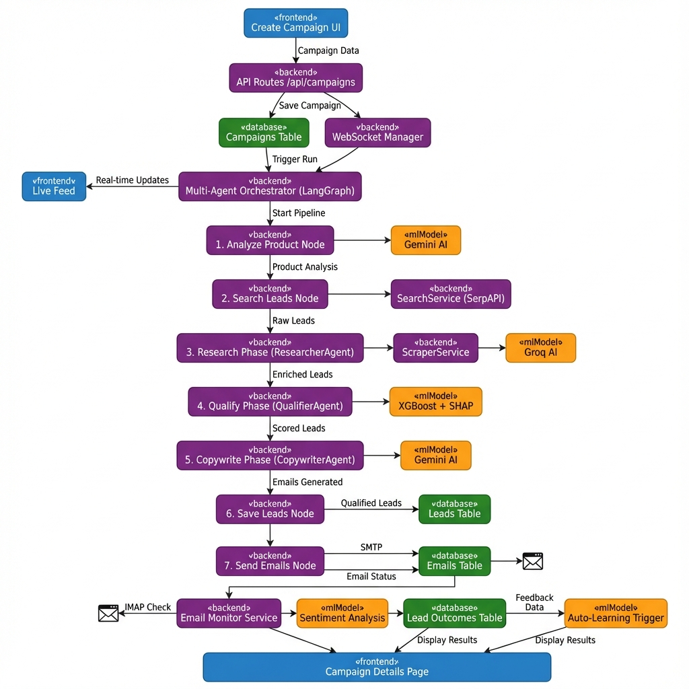
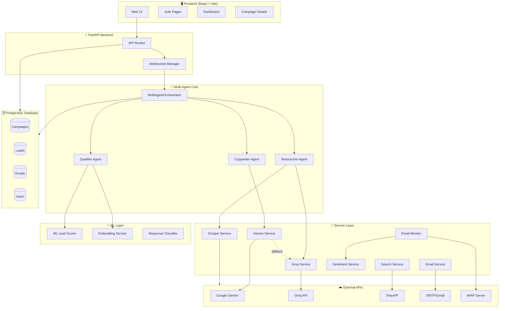
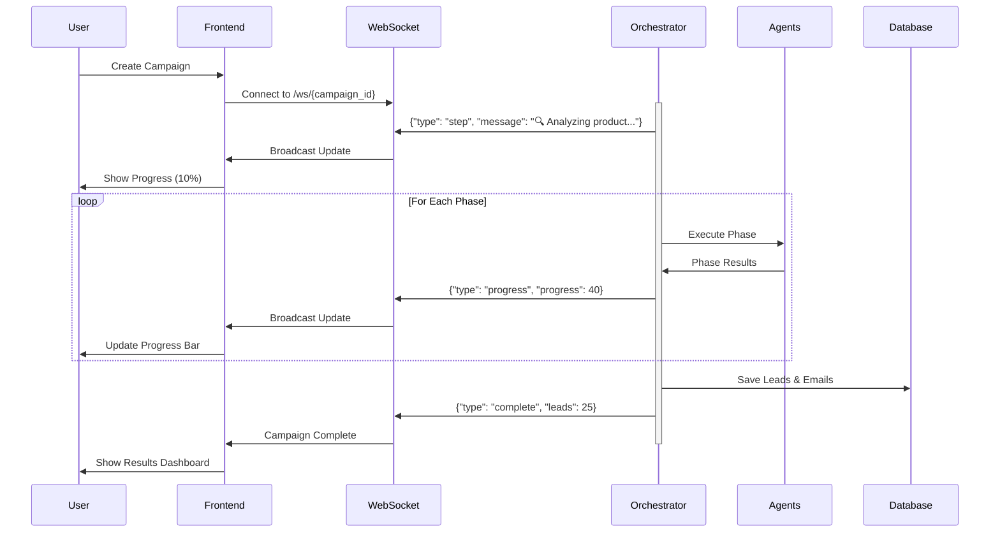
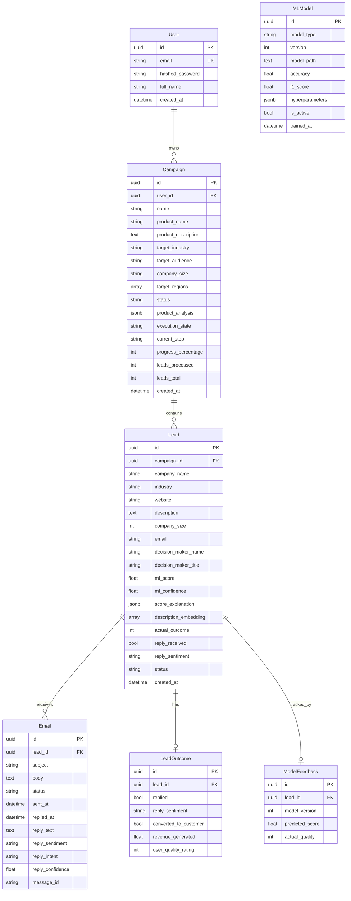
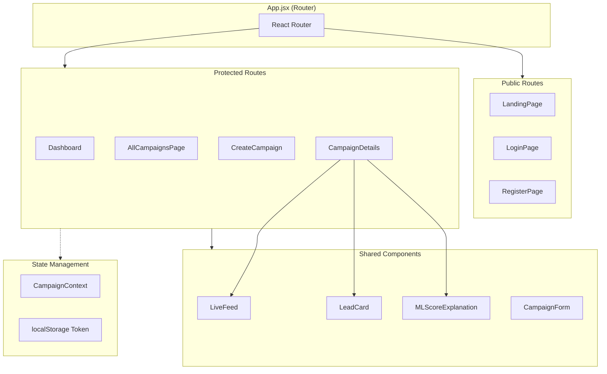
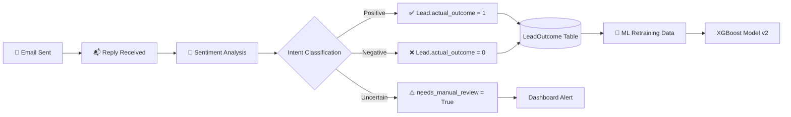

# AI-Powered B2B Sales Agent - System Flow Diagram & Architecture

> **Generated:** December 9, 2025  
> **Based on:** Live codebase analysis (not outdated MD files)

---

## 📊 System Flow Diagram



*Fig 1: System Flow Diagram of AI-Powered B2B Sales Agent*

### Color Legend
| Color | Component Type | Examples |
|-------|---------------|----------|
| 🔵 Blue | Frontend (React) | Dashboard, Create Campaign UI, Live Feed, Campaign Details |
| 🟣 Purple | Backend (FastAPI) | API Routes, Multi-Agent Orchestrator, All 7 Workflow Nodes |
| 🟢 Green | Database (PostgreSQL) | Campaigns, Leads, Emails, Lead Outcomes Tables |
| 🟠 Orange | ML/AI | XGBoost Lead Scorer, Gemini AI, Groq AI, Sentiment Analysis |

### Workflow Nodes (Exact from `multi_agent.py`)
1. **analyze_product** → Uses Gemini AI to extract keywords, ICP, pain points
2. **search_leads** → Uses SearchService (SerpAPI/Google/Bing)
3. **research_phase** → Uses ResearcherAgent + ScraperService + Groq AI
4. **qualify_phase** → Uses QualifierAgent + XGBoost ML + SHAP
5. **copywrite_phase** → Uses CopywriterAgent + Gemini AI
6. **save_leads** → Saves to PostgreSQL Leads table
7. **send_emails** → Uses EmailService (SMTP) + saves to Emails table

---

## 🏗️ High-Level System Architecture



---

## 📊 Complete Multi-Agent Workflow

This is the **actual workflow** from `multi_agent.py` - the LangGraph-based orchestration:

```mermaid
flowchart TD
    Start([🚀 Campaign Started]) --> Analyze

    subgraph Phase1["Phase 1: Product Analysis"]
        Analyze[📦 Analyze Product Node]
        Analyze -->|"Gemini AI"| ProductJSON["Product Analysis JSON<br/>(keywords, ICP, value propositions)"]
    end

    ProductJSON --> Search

    subgraph Phase2["Phase 2: Lead Discovery"]
        Search[🔍 Search Leads Node]
        Search -->|"SerpAPI/Google CSE/Bing"| RawLeads["Raw Leads<br/>(company, website, snippet)"]
    end

    RawLeads --> Research

    subgraph Phase3["Phase 3: Deep Research"]
        Research[🔬 Research Phase Node]
        Research -->|"ResearcherAgent"| Batch1["Parallel Research<br/>(5 concurrent)"]
        Batch1 -->|"ScraperService"| Scrape["Scrape Websites<br/>(static + Playwright)"]
        Scrape --> Extract["Extract:<br/>• Email<br/>• Description<br/>• Industry<br/>• Company Size<br/>• Decision Makers"]
        Extract -->|"Groq AI"| EnrichedLeads["Researched Leads"]
    end

    EnrichedLeads --> Qualify

    subgraph Phase4["Phase 4: ML Qualification"]
        Qualify[⭐ Qualify Phase Node]
        Qualify -->|"QualifierAgent"| MLScore["XGBoost ML Scoring"]
        MLScore --> Features["Feature Extraction:<br/>• industry_match<br/>• size_fit<br/>• keyword_density<br/>• description_similarity"]
        Features --> SHAP["SHAP Explanations"]
        SHAP --> QualifiedLeads["Qualified Leads<br/>(score + tier: HOT/WARM/COLD)"]
    end

    QualifiedLeads --> Copywrite

    subgraph Phase5["Phase 5: Email Generation"]
        Copywrite[✍️ Copywrite Phase Node]
        Copywrite -->|"CopywriterAgent"| EmailGen["Gemini AI Email<br/>Generation"]
        EmailGen --> Personalized["Personalized Emails<br/>(subject + body)"]
    end

    Personalized --> Save

    subgraph Phase6["Phase 6: Persistence"]
        Save[💾 Save Leads Node]
        Save --> Database[(PostgreSQL)]
    end

    Database --> Send

    subgraph Phase7["Phase 7: Outreach"]
        Send[📧 Send Emails Node]
        Send -->|"EmailService"| SMTP[SMTP Server]
        SMTP --> Sent["Emails Sent<br/>(status tracked)"]
    end

    Sent --> Complete([✅ Campaign Complete])

    style Phase1 fill:#e8f5e9
    style Phase2 fill:#e3f2fd
    style Phase3 fill:#fff3e0
    style Phase4 fill:#fce4ec
    style Phase5 fill:#f3e5f5
    style Phase6 fill:#e0f2f1
    style Phase7 fill:#fff8e1
```



---

## 🔄 Real-Time WebSocket Communication Flow



---

## 🗄️ Database Schema (ERD)



---

## 🧩 Service Layer Architecture

| Service | File | Purpose | External Dependency |
|---------|------|---------|---------------------|
| **GeminiService** | `gemini_service.py` | AI text generation (with Groq fallback) | Google Gemini API |
| **GroqService** | `groq_service.py` | Fast AI inference (fallback/research) | Groq API |
| **SearchService** | `search_service.py` | Multi-provider search (SerpAPI → Google CSE → Bing → DuckDuckGo) | SerpAPI, Google, Bing |
| **ScraperService** | `scraper_service.py` | Website scraping (static + Playwright) | None (uses requests/Playwright) |
| **EmailService** | `email_service.py` | Send emails via SMTP | Gmail/MailHog |
| **EmailMonitorService** | `email_monitor_service.py` | Monitor inbox for replies via IMAP | IMAP (Gmail/Outlook) |
| **SentimentService** | `sentiment_service.py` | Analyze reply sentiment | Gemini AI |

---

## 🤖 ML Pipeline

```mermaid
flowchart LR
    subgraph Input["Input Data"]
        Lead[Lead Data]
        Product[Product Analysis]
    end

    subgraph FeatureEngineering["Feature Extraction"]
        F1["industry_match (0-1)"]
        F2["size_fit (0-1)"]
        F3["keyword_density (0-1)"]
        F4["description_length"]
        F5["has_email (bool)"]
        F6["has_linkedin (bool)"]
        F7["semantic_similarity"]
    end

    subgraph Model["XGBoost Model"]
        XGB["lead_scorer_v1.json"]
    end

    subgraph Output["Scoring Output"]
        Score["ML Score (0-100)"]
        Tier["Tier: HOT/WARM/COLD"]
        Factors["Top 5 SHAP Factors"]
    end

    Lead --> FeatureEngineering
    Product --> FeatureEngineering
    FeatureEngineering --> Model
    Model --> Output
```



### Scoring Tiers
- **🔥 HOT** (≥70%): High-priority lead, strong product fit
- **🌤️ WARM** (40-69%): Moderate fit, worth pursuing
- **❄️ COLD** (<40%): Low priority, weak fit signals

---

## 🖥️ Frontend Architecture



### Key Pages
| Page | Path | Purpose |
|------|------|---------|
| `Dashboard` | `/dashboard` | Campaign overview, quick stats |
| `CreateCampaign` | `/campaigns/new` | Create new campaign form |
| `AllCampaignsPage` | `/campaigns/all` | List all campaigns |
| `CampaignDetails` | `/campaign/:id` | Live execution, leads, emails |

---

## ⚙️ API Endpoints

### Authentication (`/api/auth`)
| Method | Endpoint | Description |
|--------|----------|-------------|
| POST | `/register` | Create new user |
| POST | `/login` | Get JWT token |

### Campaigns (`/api/campaigns`)
| Method | Endpoint | Description |
|--------|----------|-------------|
| POST | `/` | Create campaign |
| GET | `/` | List all campaigns |
| GET | `/{id}` | Get campaign details + stats |
| PUT | `/{id}` | Update campaign inputs |
| DELETE | `/{id}` | Delete campaign + leads |
| POST | `/{id}/stop` | Stop running campaign |
| POST | `/{id}/rerun` | Delete leads & restart |
| WS | `/ws/{id}` | Real-time WebSocket feed |

### Email Monitor (`/api/email-monitor`)
| Method | Endpoint | Description |
|--------|----------|-------------|
| POST | `/check` | Manually check for replies |
| GET | `/stats` | Reply statistics |

---

## 🔄 Auto-Learning Loop

The system implements an auto-learning feedback loop:



---

## 📁 Project File Structure

```
sales-agent/
├── backend/
│   ├── app/
│   │   ├── main.py              # FastAPI entry point
│   │   ├── config.py            # Environment settings
│   │   ├── api/
│   │   │   └── routes/
│   │   │       ├── auth.py      # Auth endpoints
│   │   │       ├── campaigns.py # Campaign CRUD + WebSocket
│   │   │       └── email_monitor.py
│   │   ├── core/
│   │   │   ├── multi_agent.py   # 🌟 Main orchestrator (LangGraph)
│   │   │   ├── langgraph_agent.py
│   │   │   └── agent_prompts.py
│   │   ├── services/
│   │   │   ├── gemini_service.py
│   │   │   ├── groq_service.py
│   │   │   ├── scraper_service.py
│   │   │   ├── search_service.py
│   │   │   ├── email_service.py
│   │   │   ├── email_monitor_service.py
│   │   │   └── sentiment_service.py
│   │   ├── ml/
│   │   │   ├── lead_scorer.py   # XGBoost + SHAP
│   │   │   ├── embeddings.py
│   │   │   └── response_classifier.py
│   │   └── models/
│   │       ├── database.py
│   │       ├── tables.py        # SQLAlchemy models
│   │       └── schemas.py       # Pydantic schemas
│   ├── models/                   # ML model files (.json)
│   └── requirements.txt
│
├── frontend/
│   ├── src/
│   │   ├── App.jsx              # React Router
│   │   ├── pages/               # Page components
│   │   ├── components/          # Reusable UI
│   │   ├── context/             # State management
│   │   └── api/                 # API client
│   ├── package.json
│   └── vite.config.ts
│
└── start.bat                     # Launch script
```

---

## 🚀 Execution Modes

The system supports two execution modes (configured via `USE_LANGGRAPH` env var):

| Mode | File | Description |
|------|------|-------------|
| **Multi-Agent (Default)** | `multi_agent.py` | LangGraph-based collaborative agents |
| **LangGraph Standard** | `langgraph_agent.py` | Alternative parallel execution |

---

## 🔐 Security Features

1. **JWT Authentication** - Token-based auth stored in localStorage
2. **Password Hashing** - bcrypt for secure password storage
3. **Protected Routes** - Frontend guards for authenticated pages
4. **CORS** - Configured for development (allow all origins)
5. **Campaign Ownership** - User-to-campaign relationship enforced

---

## 📊 Key Metrics Tracked

| Metric | Location | Purpose |
|--------|----------|---------|
| `leads_total` | Campaign | Total leads discovered |
| `leads_processed` | Campaign | Leads fully processed |
| `progress_percentage` | Campaign | 0-100 execution progress |
| `ml_score` | Lead | Quality prediction |
| `reply_received` | Lead | Response tracking |
| `reply_sentiment` | Lead | Positive/Negative/Neutral |
| `emails_sent` | Via Email count | Outreach volume |

---

## 💡 Summary

This **AI-Powered B2B Sales Agent** is a full-stack application that:

1. **Discovers** leads via multi-provider search (SerpAPI, Google, Bing)
2. **Researches** companies using intelligent web scraping
3. **Qualifies** leads with XGBoost ML + SHAP explanations
4. **Generates** personalized emails using Gemini AI
5. **Sends** outreach via SMTP with delivery tracking
6. **Monitors** replies and analyzes sentiment
7. **Learns** from outcomes to improve future predictions

The multi-agent architecture (ResearcherAgent, QualifierAgent, CopywriterAgent) orchestrated by LangGraph enables parallel processing and stateful workflow management, making the system efficient and scalable.
