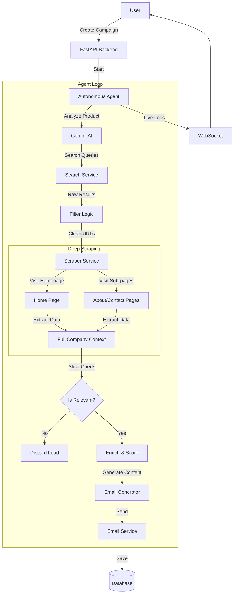

# AI-Powered B2B Sales Agent - Application Flow

This document details the end-to-end workflow of the application, from user login to the autonomous agent's execution loop.

## 1. User Interaction (Frontend)
The user interacts with the application via a React-based frontend.

1.  **Authentication**: User logs in (`/login`). The backend validates credentials and issues a JWT token.
2.  **Campaign Creation**: User starts a new campaign by providing:
    *   **Product Description**: What they are selling.
    *   **Target Industry**: Who they want to sell to.
3.  **Dashboard**: User views running campaigns, leads found, and emails sent.

## 2. Backend Processing (API Layer)
The backend is built with FastAPI.

1.  **API Request**: When a campaign is created, the API saves it to the PostgreSQL database.
2.  **Agent Trigger**: The API initializes an `AutonomousAgent` instance for that campaign and starts it as a background task.
3.  **WebSocket**: The frontend connects to a WebSocket (`/ws/campaign/{id}`) to receive real-time logs from the agent.

## 3. The Autonomous Agent Loop
This is the core intelligence of the system. It runs in a continuous loop until the campaign is stopped or completed.

### Phase 1: Analysis & Strategy
*   **Product Analysis**: The agent sends the product description to **Gemini (AI)** to understand:
    *   Key selling points.
    *   Ideal customer profile (ICP).
    *   Pain points the product solves.
*   **Query Generation**: Based on the analysis, Gemini generates targeted search queries (e.g., `"Logistics companies contact us"`, `"SaaS for supply chain"`).

### Phase 2: Discovery (Search & Filter)
*   **Multi-Provider Search**: The agent uses `SearchService` to query Google, Bing, or SerpAPI.
*   **Initial Filtering**: Results are filtered to remove:
    *   Social media profiles (Facebook, LinkedIn *profiles* - company pages are kept).
    *   Blacklisted domains (Medium, Wikipedia, Yelp, etc.).
    *   Irrelevant titles ("Top 10 lists", "Reviews", "Best of").

### Phase 3: Deep Investigation (Scraping)
*   **Main Page Scan**: The `ScraperService` visits the company's homepage.
*   **Deep Crawl**: The scraper **visits sub-pages** (About Us, Services, Contact, Team) to gather a complete picture of the company.
*   **Data Extraction**: It extracts:
    *   Company Description.
    *   Industry & Size.
    *   **Decision Makers** (CEO, CTO, etc., from "Team" pages).
    *   **Emails**: It looks for emails on the page and in `mailto:` links. If none are found, it launches a **headless browser (Playwright)** to find dynamic/hidden emails.

### Phase 4: Strict Verification (The "Brain")
*   **Relevance Check**: The agent sends the *entire* gathered context (homepage + subpages) to Gemini with a strict prompt:
    *   *"Does this company operate in the target industry?"*
    *   *"Do they realistically need this product?"*
*   **Decision**:
    *   **If NO**: The lead is immediately **discarded**.
    *   **If YES**: The lead proceeds to the next step.

### Phase 5: Enrichment & Scoring
*   **Enrichment**: Gemini analyzes the scraped text to infer missing details (e.g., specific technologies used, business model).
*   **Scoring**: Gemini assigns a score (0-100) based on how well the company matches the Ideal Customer Profile.
    *   *Factors*: Industry match, company size, technology fit.

### Phase 6: Outreach
*   **Email Generation**: For high-scoring leads, Gemini writes a **hyper-personalized email** referencing specific details found on their website (e.g., "I saw you recently launched X...").
*   **Sending**: The `EmailService` sends the email via SMTP (Gmail/MailHog).
*   **Logging**: The email and lead status are saved to the database.

## 4. Data Flow Diagram

