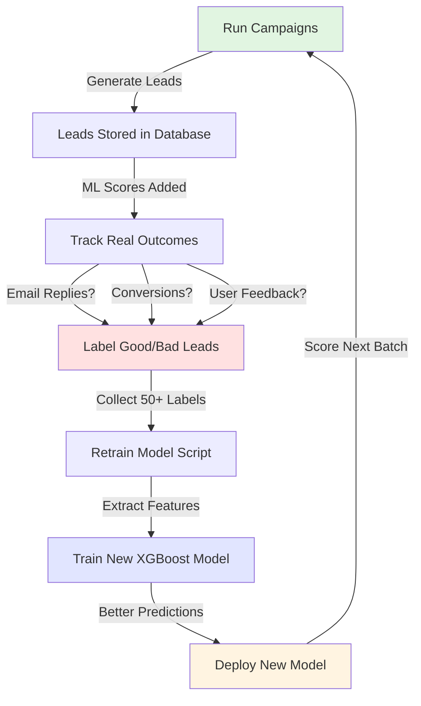

# How XGBoost Learns - Complete Guide

## Current Status: Using Synthetic Data 🎲

Right now, your XGBoost model was trained on **fake random data** (200 samples). It works, but it doesn't really "know" what makes a good lead yet.

## The Learning Lifecycle 🔄



## Step-by-Step: How It Will Learn

### Phase 1: Collect Real Data 📊

**What's happening now:**
- You run campaigns
- Agent scores leads with XGBoost (using current model)
- Scores saved to database ✅
- Emails sent to leads

**What you need to track:**
```sql
-- Add these columns to your leads table:
ALTER TABLE leads ADD COLUMN actual_outcome INTEGER; -- 1 = good, 0 = bad
ALTER TABLE leads ADD COLUMN email_replied BOOLEAN;
ALTER TABLE leads ADD COLUMN became_customer BOOLEAN;
ALTER TABLE leads ADD COLUMN manual_rating INTEGER; -- Your rating 1-5
```

### Phase 2: Label Outcomes 🏷️

After each campaign, **you manually review** which leads were actually good:

| Lead | ML Predicted | Email Replied? | Good Lead? |
|------|-------------|----------------|------------|
| TechCorp | 0.87 | ✅ Yes | ✅ 1 (Good) |
| PlumbingCo | 0.92 | ❌ No | ❌ 0 (Bad) |
| SaaS Inc | 0.65 | ✅ Yes | ✅ 1 (Good) |

**How to label:**
```python
# In your database or admin panel
UPDATE leads SET actual_outcome = 1 WHERE id = 'lead-123'; -- Good lead
UPDATE leads SET actual_outcome = 0 WHERE id = 'lead-456'; -- Bad lead
```

### Phase 3: Retrain the Model 🧠

Once you have **50+ labeled leads**, run:

```bash
cd c:\Users\91767\Desktop\AI_Powered_B2B_Sales_Agent_C\AI_Powered_B2B_Sales_Agent_C\sales-agent\backend
python scripts/retrain_with_real_data.py
```

This will:
1. Extract all labeled leads from database
2. Calculate features (same 11 features as before)
3. Train a NEW XGBoost model
4. **The model learns patterns** like:
   - "Leads with tech keywords + big company size = usually good"
   - "Leads without email = usually bad"
   - "Retail industry for our SaaS product = usually bad"
5. Save the improved model
6. Replace the old model

### Phase 4: Continuous Improvement 📈

**The improvement cycle:**

```
Week 1: Run 5 campaigns → 50 leads → Label 30 good, 20 bad
Week 2: Retrain model → Now 68% accurate (was 67%)
Week 3: Run 5 more campaigns → 50 leads → Model gets better at picking
Week 4: Retrain model → Now 75% accurate
Month 2: 200 leads labeled → Model is 82% accurate
Month 3: 500 leads labeled → Model is 88% accurate ⭐
```

## What You Need to Do

### Option 1: Manual Feedback (Recommended for Start)

After each campaign:
1. Review the leads in your dashboard
2. Mark which ones were good/bad
3. Every few weeks, run the retrain script

### Option 2: Automatic Feedback (Advanced)

Track email engagement automatically:
- Email opened → +1 point
- Email replied → Lead is probably good (outcome = 1)
- Email bounced → Lead is probably bad (outcome = 0)
- Unsubscribed → Lead is definitely bad (outcome = 0)

### Option 3: Conversion Tracking (Best)

Integrate with your CRM:
- Lead became a customer → outcome = 1 (definitely good!)
- Lead ghosted after 3 follow-ups → outcome = 0 (bad)

## Database Schema You Need

Add to your `leads` table:

```python
# In app/models/tables.py
class Lead(Base):
    __tablename__ = "leads"
    
    # ... existing columns ...
    
    # NEW: For learning
    actual_outcome = Column(Integer, nullable=True)  # 1=good, 0=bad, None=unknown
    email_replied = Column(Boolean, default=False)
    became_customer = Column(Boolean, default=False)
    manual_rating = Column(Integer, nullable=True)  # 1-5 stars
    feedback_notes = Column(Text, nullable=True)  # Your notes
    labeled_at = Column(DateTime, nullable=True)  # When you labeled it
```

## Quick Start Guide

1. **Run campaigns** (you're already doing this! ✅)

2. **After 1 week**, manually review your leads:
   ```python
   # In Python shell or admin UI
   from app.models.database import SessionLocal
   from app.models.tables import Lead
   
   db = SessionLocal()
   lead = db.query(Lead).filter(Lead.company_name == "TechCorp").first()
   lead.actual_outcome = 1  # This was a good lead!
   db.commit()
   ```

3. **Once you have 50+ labeled leads**, retrain:
   ```bash
   python scripts/retrain_with_real_data.py
   ```

4. **Repeat every 2-4 weeks** as you collect more data

## Summary

**How it learns:**
- ✅ **Now**: Using synthetic data (works but not optimized)
- 🔄 **Soon**: You label real outcomes manually
- 🤖 **Later**: Automatic feedback from email engagement
- 🎯 **Eventually**: Fully optimized model trained on 500+ real leads

**The model gets smarter** every time you:
1. Run campaigns (collect data)
2. Label outcomes (teach it)
3. Retrain (it learns patterns)

Think of it like training a puppy - the more examples you give it (good vs bad leads), the better it gets at recognizing them! 🐕
