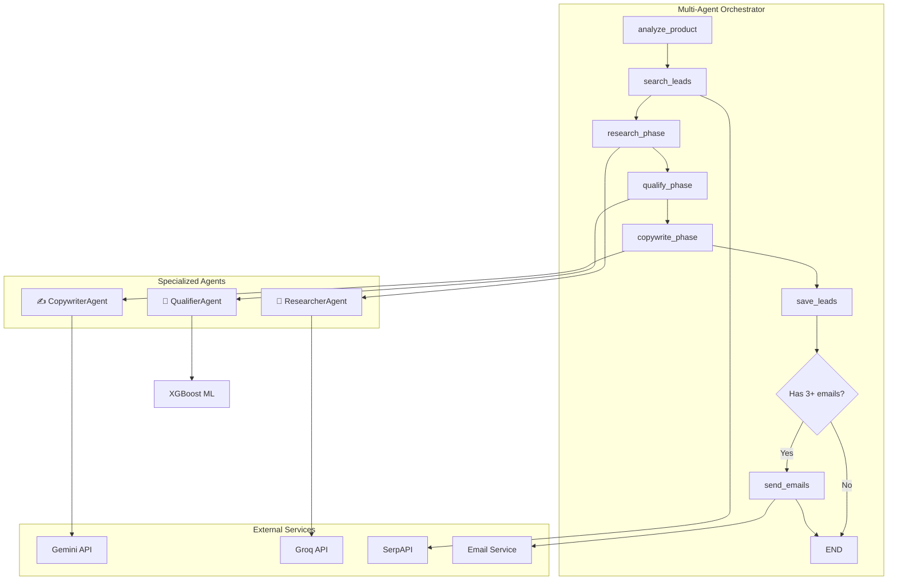

# 🤖 Multi-Agent B2B Sales System - Architecture Documentation

This document provides a complete technical overview of the Multi-Agent B2B Sales System implemented using **LangGraph**.

---

## 📋 Table of Contents

1. [System Overview](#system-overview)
2. [Architecture Diagram](#architecture-diagram)
3. [State Management](#state-management)
4. [Specialized Agents](#specialized-agents)
5. [Workflow Nodes](#workflow-nodes)
6. [Data Flow](#data-flow)
7. [API Providers](#api-providers)
8. [Configuration](#configuration)

---

## System Overview

The Multi-Agent system is a **collaborative AI architecture** where specialized agents work together to:

1. **Research** companies and extract intelligence
2. **Qualify** leads using ML + AI scoring
3. **Generate** personalized outreach emails
4. **Send** emails and track results

### Key Technologies

| Component | Technology |
|-----------|------------|
| **Orchestration** | LangGraph (StateGraph) |
| **Primary LLM** | Google Gemini 2.0 Flash |
| **Fallback LLM** | Groq (LLaMA 3.1 8B) |
| **ML Scoring** | XGBoost + SHAP |
| **Embeddings** | Sentence Transformers |
| **Web Scraping** | BeautifulSoup + Requests |

### File Locations

| File | Purpose |
|------|---------|
| [multi_agent.py](file:///c:/Users/91767/Desktop/AI_Powered_B2B_Sales_Agent_C/AI_Powered_B2B_Sales_Agent_C/sales-agent/backend/app/core/multi_agent.py) | Main orchestrator and agents |
| [agent_prompts.py](file:///c:/Users/91767/Desktop/AI_Powered_B2B_Sales_Agent_C/AI_Powered_B2B_Sales_Agent_C/sales-agent/backend/app/core/agent_prompts.py) | All agent system prompts |
| [gemini_service.py](file:///c:/Users/91767/Desktop/AI_Powered_B2B_Sales_Agent_C/AI_Powered_B2B_Sales_Agent_C/sales-agent/backend/app/services/gemini_service.py) | Gemini API with Groq fallback |
| [groq_service.py](file:///c:/Users/91767/Desktop/AI_Powered_B2B_Sales_Agent_C/AI_Powered_B2B_Sales_Agent_C/sales-agent/backend/app/services/groq_service.py) | Groq API service |

---

## Architecture Diagram



---

## State Management

The system uses a **typed state dictionary** that flows through all nodes:

```python
class MultiAgentState(TypedDict):
    campaign_id: str              # Unique campaign identifier
    campaign: Dict                # Campaign configuration
    current_phase: str            # Current workflow phase
    progress: float               # 0-100% progress

    # Product analysis
    product_analysis: Dict        # Keywords, ICP, pain points

    # Leads at different stages
    raw_leads: List[Dict]         # From search
    researched_leads: List[Dict]  # After enrichment
    qualified_leads: List[Dict]   # After scoring
    leads_with_emails: List[Dict] # With generated emails

    # Control
    errors: List[str]             # Any errors encountered
    emails_sent: int              # Count of sent emails
```

### State Progression

| Phase | Progress | State Updated |
|-------|----------|---------------|
| Analyze Product | 10% | `product_analysis` |
| Search Leads | 25% | `raw_leads` |
| Research | 45% | `researched_leads` |
| Qualify | 65% | `qualified_leads` |
| Copywrite | 80% | `leads_with_emails` |
| Save | 90% | Database |
| Send Emails | 100% | `emails_sent` |

---

## Specialized Agents

### 🔬 ResearcherAgent

**Purpose**: Deep company research and data extraction

**API**: Uses **Groq FIRST** (FREE, 14K requests/day) → **Gemini as fallback**

> [!TIP]
> Using Groq first saves your Gemini quota since research involves 20+ API calls per campaign.

**Capabilities**:
- Web scraping via ScraperService
- AI-powered company analysis
- Email extraction
- Technology stack detection
- Pain point identification

**Key Methods**:
```python
# Research a single company
async def research_company(company: Dict, product_analysis: Dict) -> Dict

# Batch research with concurrency control
async def research_batch(companies: List[Dict], ..., max_concurrent=5) -> List[Dict]
```

**Output Fields**:
- `company_name`, `industry`, `sub_industry`
- `technology_stack`: Tools they use
- `pain_points`: Business challenges
- `decision_makers`: Key contacts
- `contact_email`: Extracted email
- `research_confidence`: 0.0-1.0

---

### 🎯 QualifierAgent

**Purpose**: Lead scoring with ML + AI reasoning

**API**: **ML-only mode** by default (NO API calls) - configurable

**Scoring Components**:

| Component | Weight | Source |
|-----------|--------|--------|
| ML Score | 50% | XGBoost model |
| Semantic Similarity | 50% | Embeddings |

**Qualification Tiers**:
- 🔥 **HOT** (≥70%): High priority, immediate outreach
- 🟡 **WARM** (50-69%): Good fit, worth pursuing
- 🔵 **COLD** (40-49%): Needs nurturing
- ❌ **DISQUALIFY** (<40%): Not a fit

**Modes** (via `QUALIFICATION_MODE` env var):
1. `ml_only` – No API calls, pure ML scoring (default)
2. `ml_ai` – ML + Gemini reasoning
3. `ai_only` – Full Gemini analysis

---

### ✍️ CopywriterAgent

**Purpose**: Personalized email generation

**API**: Uses **Gemini** with Groq fallback

**Email Variants Generated**:
1. **INSIGHT-LED**: Lead with industry insights
2. **DIRECT-PITCH**: Clear value proposition
3. **SOCIAL-PROOF**: Case studies and results

**Email Rules**:
- Maximum 120 words
- Personalized subject lines
- Reference company-specific details
- Clear call-to-action

**Retry Logic**:
- 2 retries with exponential backoff
- 90s timeout per email
- Groq fallback on Gemini failure

---

## Workflow Nodes

The workflow consists of **7 sequential nodes** orchestrated by LangGraph:

### Node 1: `analyze_product`

**Purpose**: Analyze the product/service for targeting

**Input**: Campaign description, target industry, audience

**Output**: 
```python
{
    "product_summary": "One-sentence value prop",
    "keywords": ["keyword1", "keyword2"],
    "target_industries": ["Industry 1", "Industry 2"],
    "pain_points_solved": ["Pain 1", "Pain 2"],
    "ideal_customer_profile": {...}
}
```

**Progress**: 0% → 10%

---

### Node 2: `search_leads`

**Purpose**: Find potential leads via SerpAPI

**Process**:
1. Generate queries from keywords × industries (max 15 queries)
2. Execute searches via SerpAPI
3. Filter out blacklisted domains (social media, directories)
4. Extract company names from URLs
5. Deduplicate by domain

**Output**: List of raw leads with `company_name`, `website`, `description`

**Progress**: 10% → 25%

---

### Node 3: `research_phase`

**Purpose**: Deep research on each company

**Agent**: 🔬 ResearcherAgent

**Process**:
1. Scrape company website (30s timeout)
2. AI analysis via Groq (90s timeout)
3. Extract emails, pain points, tech stack
4. Parallel processing (5 concurrent)

**Configurable**: `MAX_LEADS_TO_RESEARCH` (default: 20)

**Progress**: 25% → 45%

---

### Node 4: `qualify_phase`

**Purpose**: Score and rank all leads

**Agent**: 🎯 QualifierAgent

**Process**:
1. ML scoring via XGBoost
2. Semantic similarity via embeddings
3. Combined weighted score
4. Tier assignment (HOT/WARM/COLD)
5. Sort by score descending

**Configurable**: `MAX_LEADS_TO_QUALIFY` (default: 15)

**Progress**: 45% → 65%

---

### Node 5: `copywrite_phase`

**Purpose**: Generate personalized emails

**Agent**: ✍️ CopywriterAgent

**Process**:
1. Filter leads WITH email addresses
2. Generate 3 email variants per lead
3. Select recommended variant
4. Retry failed emails (2 retries)

**Configurable**: `MAX_EMAILS_TO_GENERATE` (default: 10)

**Progress**: 65% → 80%

---

### Node 6: `save_leads`

**Purpose**: Persist leads to database

**Process**:
1. Save all qualified leads to `Lead` table
2. Skip duplicates (same company + campaign)
3. Store scores, emails, descriptions

**Progress**: 80% → 90%

---

### Node 7: `send_emails`

**Purpose**: Send personalized outreach emails

**Condition**: Only runs if ≥3 emails generated

**Process**:
1. Send via SMTP (MailHog or Gmail)
2. Create `Email` record in database
3. Emit success message per email

**Progress**: 90% → 100%

---

## Data Flow

```mermaid
flowchart LR
    subgraph Input
        Campaign[Campaign Config]
    end

    subgraph "Phase 1: Analysis"
        Product[Product Analysis]
    end

    subgraph "Phase 2: Discovery"
        Search[SerpAPI Search]
        Raw[30 Raw Leads]
    end

    subgraph "Phase 3: Enrichment"
        Scrape[Web Scraping]
        AI1[Groq Research]
        Enriched[20 Researched Leads]
    end

    subgraph "Phase 4: Qualification"
        ML[XGBoost Scoring]
        EMB[Embeddings]
        Qualified[14 Qualified Leads]
    end

    subgraph "Phase 5: Outreach"
        AI2[Gemini Copywriting]
        Emails[10 Emails Generated]
        Send[4 Emails Sent]
    end

    Campaign --> Product --> Search --> Raw
    Raw --> Scrape --> AI1 --> Enriched
    Enriched --> ML --> Qualified
    Enriched --> EMB --> Qualified
    Qualified --> AI2 --> Emails --> Send
```



---

## API Providers

### Gemini (Primary LLM)

**Used For**:
- Product analysis
- Email copywriting

**Fallback**: Switches to Groq on quota exhaustion (429 error)

**Config**:
```env
GEMINI_API_KEY=your-key
GEMINI_MODEL=gemini-2.0-flash
```

---

### Groq (Fast LLM)

**Used For**:
- Company research (FREE, no quota issues)
- Gemini fallback

**Benefits**:
- 14,400 requests/day FREE
- Very fast inference
- Saves Gemini quota

**Config**:
```env
GROQ_API_KEY=your-key
GROQ_MODEL=llama-3.1-8b-instant
GROQ_ENABLED=true
```

---

### SerpAPI (Search)

**Used For**: Finding potential leads via Google search

**Config**:
```env
SERP_API_KEY=your-key
MAX_SEARCH_RESULTS=10
```

---

## Configuration

All limits are configurable via environment variables:

| Variable | Default | Description |
|----------|---------|-------------|
| `MAX_SEARCH_RESULTS` | 10 | Results per search query |
| `MAX_LEADS_TO_RESEARCH` | 20 | Leads to enrich |
| `MAX_LEADS_TO_QUALIFY` | 15 | Leads to score |
| `MAX_EMAILS_TO_GENERATE` | 10 | Emails to create |
| `QUALIFICATION_MODE` | `ml_only` | Scoring mode |
| `GROQ_ENABLED` | `true` | Use Groq for research |

### Timeout Settings

| Operation | Timeout | Retries |
|-----------|---------|---------|
| Web scraping | 30s | 0 |
| Company research | 90s | 0 |
| Agent invoke | 90s | 3 |
| Email generation | 90s | 2 |
| Groq API | 60s | 2 |

---

## Stop Campaign Feature

The system supports **graceful campaign stopping**:

1. User clicks "Stop" in UI
2. Campaign status updated to `stopped` in database
3. Each agent checks `stop_check()` callback before processing
4. Workflow halts and emits `🛑 Campaign stopped by user`

---

## Summary

The Multi-Agent system provides a robust, scalable pipeline for B2B sales automation:

✅ **Modular**: Each agent has a focused responsibility  
✅ **Resilient**: Retry logic, fallbacks, graceful degradation  
✅ **Efficient**: Parallel processing, quota management  
✅ **Observable**: Real-time progress via WebSocket  
✅ **Configurable**: Environment-based limits
